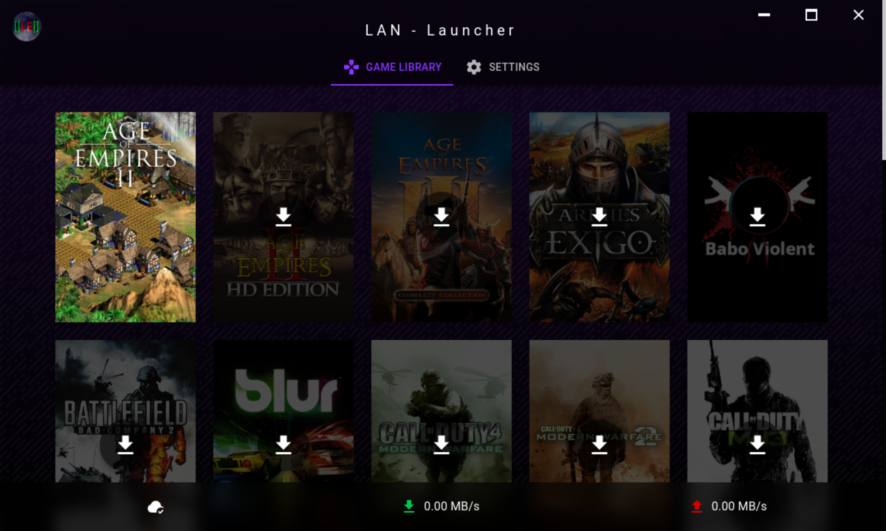

# :video_game: LEGC LAN Launcher

[](https://github.com/jul13579/le-lan-launcher/actions/workflows/build.yml)
[](https://github.com/jul13579/le-lan-launcher/actions/workflows/lint.yml)


<sup><sub>(Shown games are examples and not included in the launcher. The launcher does not include **ANY** games by itself)</sup></sub>

## :book: Description
The **LEGC LAN Launcher** mainly is a frontend for the widely known and used synchronization software *Syncthing* (https://github.com/syncthing/syncthing). The need for such a software arised every time our quite small gaming clan faced the challenge to distribute games to other LAN-Party visitors in a fast and easy way.

Instead of relying on a NAS for everyone to access, this launcher relies on *Syncthing*, the P2P synchronization software, to distribute data to LAN-Party visitors. The setup in mind is as follows:

A node (in our case the NAS) shares game folders which are set up as "send only", while the LAN Launcher subscribes to these game folders as "receive only". This does **NOT** mean that a client does not further distribute the data! Instead it means that only original and unaltered files are distributed by the client.

As *Syncthing* is written in go, it is especially suited for cross-platform use, such as e.g. on a ARM-based NAS. For a more convenient usage of *Syncthing* in this setup, some changes were made (see *patches* directory):
* First and foremost, syncthing requires you to manually bind devices to each other by prompting you for it. This feature was removed in favor of automatic device approval (especially for the NAS side).
* Some default values were altered (disabling creation of a default sync folder, disabling global discovery, disabling relays, ...)

The necessary changes are very few, so feel free to see the patches in the `patches` directory.

## :metal: Features
* Fancy customization features, including unicorns! :unicorn::rainbow:
* Multi-language support, currently english and german only!
* Set a player name in settings, which can be automatically set in numerous games (see config)
* Download/browse/delete games, pause distribution of specific games, specify multiple launch configurations (see config)
* See network usage of *Syncthing*
* Spawns games detached from launcher, so the launcher can be closed without killing the game.
* Debug mode to be used when having trouble integrating games. After launching an external executable, the launcher will show a window with the process' output.

## :floppy_disk: Installation
### Prerequisites
* git
* Node.js + npm
* Syncthing prerequisites (see Syncthing documentation for further information)

I'd advise to use the versions specified in the `build > strategy > matrix` definition of this repo's [`build.yml`](https://github.com/jul13579/le-lan-launcher/blob/master/.github/workflows/build.yml)

### Building
Download/clone the repo and run the desired build script:
* `build_all.*`: This will first run `build_syncthing.*` and then `build_app.*`
* `build_syncthing.*`: This will clone Syncthing and apply my patches to it
* `build_app.*`: This will build the launcher app. The launcher's install file will be placed inside the *dist_electron* directory.

## :wrench: Configuration
### Library
Before the launcher can be used, a device should be set up to provide the game folders and the library:

* Start the built Syncthing binary on the device (e.g. NAS; Syncthing will be available on `https://localhost:8384` by default).

* Configure a "send only" folder for each of your games. I recommend setting up every shared folder as "send only" on the NAS, since games might change e.g. configuration files which shouldn't make their way back to the NAS. Even though the Launcher subscribes to game folders using "receive only" I consider this to be a best practice.

* Configure a folder called "Library" with the folder ID **"gamelib"**. This folder will automatically subscribed by the launcher using the folder ID. The folder ID can be modified in `src/config/folder.js` prior to building.

* Inside the library folder, place the game cover images (ideally 600x900px in size) and a file called **library.json**. The name of this file can also be configured in `src/config/folder.js` prior to building. In this file you can setup the available games as follows:
  ```
  {
    "games": [
      {
        "id": "bv2",                              // Folder id (has to match Syncthing folder id)
        "title": "Babo Violent 2",                // Game title (has to match Syncthing folder name)
        "cover": "bv2.jpg",                       // Game cover image
        "launch": {                               // Launch config
          "exe": "Bv2Launcher,2.exe"              // Executable path
        },
        "moreLaunchs": {                          // More launch configs (optional)
          "text": "Foo"                           // Title for launch button
          "exe": "Bv2Launcher,2.exe"              // Executable path
        },
        "nameConfig": {                           // Name config (optional)
          "env": "foobar",                        // Env variable (optional)
          "file": "main/bv2.cfg",                 // File path
          "regex": "(?<=cl_playerName \")(.*)(?<!\")" // Replace regex (optional)
        }
      },
      ...
    ]
  }
  ```
  Most of the config should be pretty self-explanatory.
  * *id*: The id specified in this field has to be the folder ID of the game, which you have to set up on the server/NAS/etc.
  * *launch*: specifies the executable to be spawned when clicking "play". The path is relative to the game's root folder
  * *moreLaunchs*: There may be situations, where it is convenient to have a second "play" button that spawns the same executable with different parameters or even spawns a different executable. In such cases, *moreLaunchs* allows to specify such launch configs and lets you even specify a button text.
  * *nameConfig*: For games that store the player's name in a human readable file, *nameConfig* lets you specify the path to this configuration file. In case this config file does not reside inside the games folder, you can specify an environment variable using *env* after which the given file path is interpreted relative to the resolved environment variable. If the player's name is the only content of the configuration file, you should omit the *regex* attribute, as it is used for search-replacing the player's name inside the configuration file. The regex has to be specified in a way that only the to-be-replaced player name inside the file is matched.

  All executables will be launched with the following arguments:
  1. Game directory path / the Syncthing shared directory path
  2. Game ID / the Syncthing shared directory ID
  3. Player name

* Finally start up the launcher on a PC. On the first start you will be presented with the settings page. After specifying the game library path, the client's Syncthing instance should spin up.

* After a short while you should be able to see available Syncthing devices in the "NAS ID" dropdown. Select the ID that belongs to your NAS.

* Now navigate to the "Game Library" tab to start downloading your games from your NAS!

## :tada: Finished!
That's it! I hope this LAN Launcher can be of use for more that just my people! :wink:

## :bulb: Tips
* If you need to run an executable with some arguments, create a script to do so and call the script from the launch configuration.
* You are not required to run the patched Syncthing binary on either your NAS or the clients. If you want to bundle a different Syncthing binary in the launcher, just copy the binary in the project's root directory. You will however loose the modified default Syncthing arguments *and* be required to accept every new client pairing request on the NAS.
* The above configuration by far is not the only one. Since the launcher mainly is only a custom Syncthing frontend you can pretty much do whatever Syncthing offers. I will however not provide any support for these configurations as I'm not using them myself.